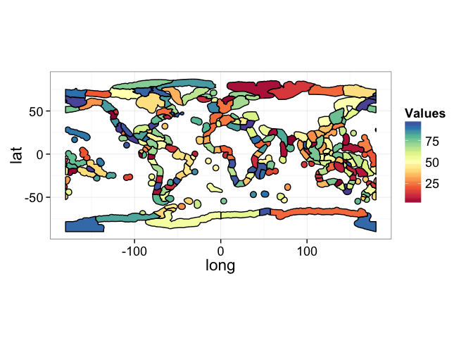

A library to work with Spalding et al.'s Marine Ecoregions of the world
-----------------------------------------------------------------------

This library was developed as I used the MEOW spatial data more and more
and wrote a few general functions. The data are from
<http://www.marineregions.org/downloads.php> downloaded on June 1st
2015. See the original paper at
<http://www.nature.org/ourinitiatives/regions/northamerica/unitedstates/colorado/scienceandstrategy/marine-ecoregions-of-the-world.pdf>

Installation
------------

    #install.packages("devtools")
    library(devtools)
    install_github("meowR", "jebyrnes")

Adding MEOW information to your data
------------------------------------

Using the sp function over, getRegions provides a wrapper to add MEOW
information to your dataset.

    data(regions)

    latlong <- data.frame(lat = c(50.0944444, 33.4691667, 34.0348833, 
         55.0869876, 51.7787776, 
         49.6088889, -35.750729),
         long=c(-127.55889, -119.53028, 
         -119.70308, -161.87444, 
         178.30199, -126.78056, 150.259155))
         
    regionalData <- getRegions(latlong$lat, latlong$long)

    newdata <- cbind(latlong, regionalData)

    newdata

    ##         lat      long                                     ECOREGION
    ## 1  50.09444 -127.5589 Oregon, Washington, Vancouver Coast and Shelf
    ## 2  33.46917 -119.5303                           Northern California
    ## 3  34.03488 -119.7031                     Southern California Bight
    ## 4  55.08699 -161.8744                                Gulf of Alaska
    ## 5  51.77878  178.3020                              Aleutian Islands
    ## 6  49.60889 -126.7806 Oregon, Washington, Vancouver Coast and Shelf
    ## 7 -35.75073  150.2592                                     Cape Howe
    ##                           PROVINCE                      REALM
    ## 1 Cold Temperate Northeast Pacific Temperate Northern Pacific
    ## 2 Cold Temperate Northeast Pacific Temperate Northern Pacific
    ## 3 Warm Temperate Northeast Pacific Temperate Northern Pacific
    ## 4 Cold Temperate Northeast Pacific Temperate Northern Pacific
    ## 5 Cold Temperate Northeast Pacific Temperate Northern Pacific
    ## 6 Cold Temperate Northeast Pacific Temperate Northern Pacific
    ## 7       Southeast Australian Shelf      Temperate Australasia

Plotting the Ecoregions, Provinces, and Realms
----------------------------------------------

    library(meowR)
    data(regions)
    data(provinces)
    data(realms)

    par(mfrow=c(2,2), mar=c(0,1,2,0))
    plot(regions, main="Ecoregion")
    plot(provinces, lwd=2, border="red", main="Province")
    plot(realms, lwd=2, border="blue", main="Realm")
    par(mfrow=c(1,1), mar=c(5, 4, 4, 2) + 0.1)

Using data.frame representations with ggplot2 and external data to make a choropleth plot
-----------------------------------------------------------------------------------------

Each SpatialPolygonsDataFrame has a parallel dataset where the regional
information is in a data frame. These have the same names as the sp
objects, but with .df in their object name. These were designed to use
with plot or ggplot2.

    data(provinces.df) 
     
    base_province_ggplot <- ggplot(provinces.df) + theme_bw() +
    aes(long,lat,group=group) + 
      geom_polygon(fill=NA) +
      geom_path(color="black") +
      coord_equal() 
      
      base_province_ggplot

    data(regions.df)

    ndf <- data.frame(Ecoregions = levels(regions.df$ECOREGION), 
    Values = runif(length(levels(regions.df$ECOREGION)), 0,100))

    makeMEOWmap(ndf, fillColName="Values", regionColName="Ecoregions")

    ## Joining by: Ecoregions

Version numbers
---------------

`meowR` uses [semantic versioning](http://semver.org/). The version
numbering scheme is `major`.`minor`.`revision`. Unless `major` is 1, the
package should not be considered stable. All releases with the same
`major` versions are compatible. Increases in `minor` represents the
addition of backwards-compatible additions. Increases in `revision`
represents either bug fixes or improvements.

Contributions
-------------

People wanting to contribute are welcome to do so by forking the
repository, and submitting a pull request when their work is done.
Please also edit the `DESCRIPTION` file to add your name to the
`Authors` field.
